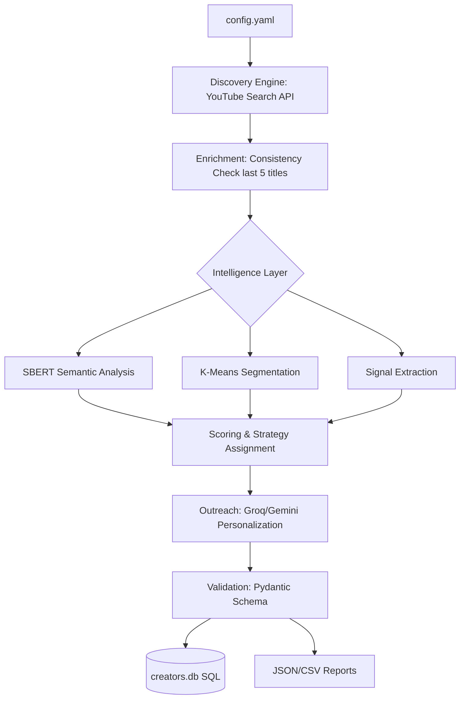

# Automated Micro-Influencer Intelligence & Outreach System

An end-to-end AI-powered pipeline designed to discover, evaluate, and engage with micro-influencers (5K - 100K subscribers) with high precision using Semantic Search and Machine Learning.

## Key Features
- **AI-Driven Discovery**: Contextual YouTube search targeting specific niches and geofenced to India.
- **Content Consistency Engine**: Analyzes creator history (last 5 videos) to distinguish "Subject Matter Experts" from "One-Hit Wonders."
- **Semantic Intelligence**: Uses **SBERT (Sentence-BERT)** to calculate Brand-Fit scores based on deep content meaning rather than just keyword matching.
- **ML Segmentation**: Implements **K-Means Clustering** to automatically group creators into strategic segments (e.g., Olympiad Prep vs. Reasoning).
- **Smart Engagement Scoring**: A reliability-weighted formula that prioritizes active, loyal audiences over raw view counts.
- **Automated Personalization**: Dual-LLM support (**Groq/Llama 3** & **Gemini**) for generating highly personalized collaboration pitches.
- **Multi-Model Fallback System**: Engineered with a primary (Groq) and fallback (Gemini) LLM architecture to ensure 100% outreach uptime.
- **Production Safety & Rate Limiting**: Intelligent sleep cycles and a "20-Creator Cap" to optimize and protect YouTube and LLM API quotas.
- **Data Integrity Layer**: Powered by **Pydantic** models to ensure strict schema validation before data persistence.
- **Multi-Format Persistence**: Concurrent exports to **SQLite (creators.db)**, **JSON**, and **CSV** for professional marketing reporting.
- **Semantic Signal Extraction**: Advanced NLP that breaks down raw transcripts into structured "Content Themes" for precision targeting.
- **Strategic Action Mapping**: Intelligent logic that assigns specific collaboration models (e.g., *Assessment Ecosystem Partnership* or *Event Sponsorship*) based on the creator's segment and audience behavior.

## Architecture



1. **Discovery Layer**: Targeted YouTube API integration.
2. **Intelligence Layer**: SBERT semantic analysis + signal extraction.
3. **Logic Layer**: Multi-factor weighted scoring and strategy assignment.
4. **Outreach Layer**: Automated personalization and email verification.
5. **Persistence Layer**: SQLite storage + Multi-format reporting (JSON/CSV).

## Setup & Usage
1. **Environment**:
   ```bash
   pip install -r requirements.txt
   ```
2. **Configuration**:
   Add your API keys to `.env` and customize your brand context in `config.yaml`.
3. **Run**:
   ```bash
   python main.py
   ```

## Outputs
- `output/top_creators.json`: Executive shortlist of the top 5 high-performing partners.
- `output/enriched_creators.json`: Full technical dataset.
- `output/enriched_creators.csv`: Marketing-ready spreadsheet.
- `creators.db`: Historical database for campaign tracking.
